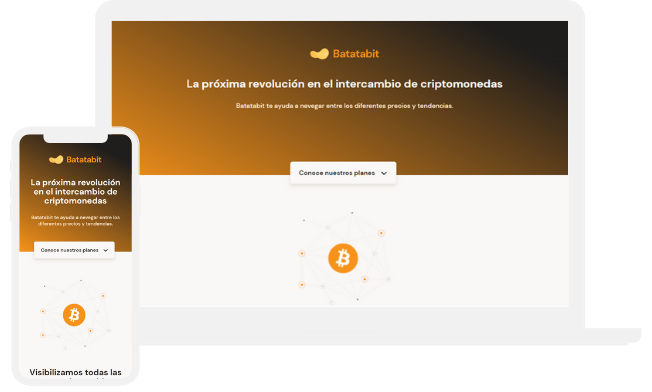

# proyecto_final_html_css

## Table of contents

- [Overview](#overview)
  - [Screenshot](#screenshot)
  - [Links](#links)
- [My process](#my-process)
  - [Built with](#built-with)
- [Author](#author)

## Overview

### Screenshot

### Links

- Solution URL: [GitHub](https://github.com/miguedebe/proyecto_final_html_css)
- Live Site URL: [GitHub Pages](https://miguedebe.github.io/proyecto_final_html_css/)

## My process

### Built with

- Semantic HTML5 markup
- CSS custom properties
- Flexbox
- Mobile-first workflow

## Author

- Twitter - [@miguedebe](https://www.twitter.com/miguedebe)
